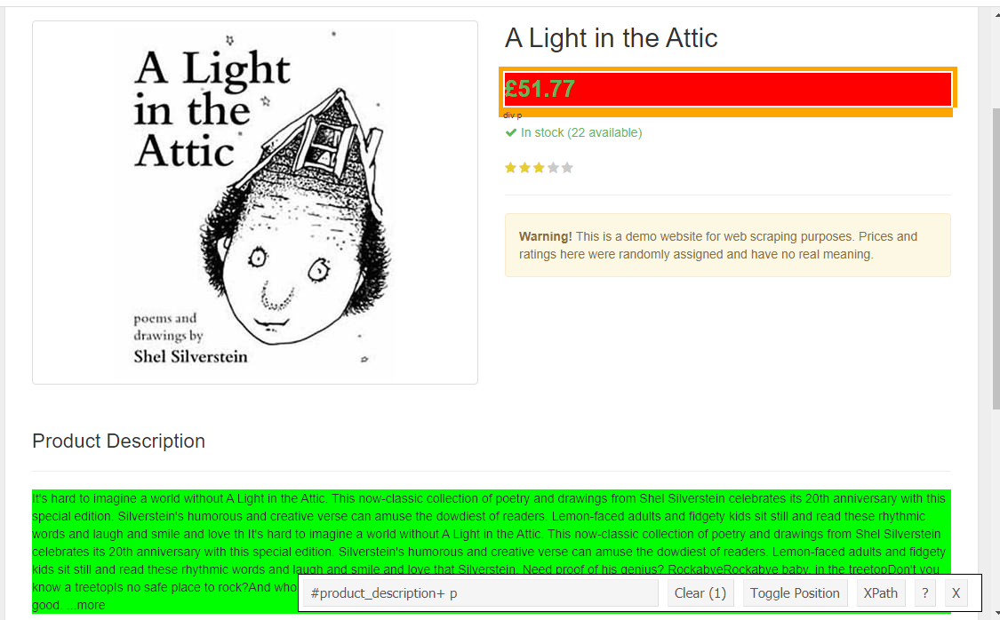

```{r setup, include=FALSE}
library(knitr)
# set some options to reduce noise
opts_chunk$set(
  echo = TRUE,
  cache = FALSE,
  prompt = FALSE,
  tidy = FALSE,
	comment = NA,
	message = FALSE,
	error = FALSE, 
	eval = TRUE,
	digits = 2)
opts_knit$set(width=75)
```

------------------------------------------------------------------------

Web scraping is a technique for automatically collecting data from the web. On a small scale, you can simply copy and paste text and other kinds of information from web pages into spreadsheets or files to use later, but this becomes very tedious and time consuming with large numbers of pages or documents. If you have lots of web pages you want to collect data from, it's probably a better investment to spend your time learning how to automatically "scrape" that data than to go through all those pages by hand. Time spent developing general skills will pay off long after you've moved onto other projects.

In this tutorial we'll go over the basics of how to use R to quickly scrape data from the web, and how to put that data into a structured format which can be used for whatever analysis you might like. 

This markdown document was built using the `{rmdformats}` package. You can download the `.Rmd` file [**here**](https://github.com/jasongraf1/Bham_CLSS_2021/blob/main/markdown/webscraping_with_R_tutorial_part1.Rmd). 

# Preliminaries

## About R 

Since we're working in R, some familiarity with R and RStudio is a necessity. This tutorial assumes you are familiar with a few of the core aspects of the "tidy" coding style, particularly the use of pipes, i.e. `%>%`. If you are new to R, I recommend the following to get started:

- [**swiRl**](https://swirlstats.com/). This is a tutorial library that works directly in R. There really isn't a better way to learn R!
- [***R for Data Science***](https://r4ds.had.co.nz/) by Hadley Wickham and Garrett Grolemund [@wickham_data_2016]. This covers all the basics for working with R using the **"tidy"** approach to programming.
- [***Text mining with R: a tidy approach***](https://www.tidytextmining.com/) by Julia Silge and David Robinson [@silge_text_2017a]. This a great introduction to the `{tidytext}` package, which is a powerful tool for doing all kinds of things with text data, including tokenization, sentiment analysis and topic modelling.

Knowledge of HTML and CSS is also a big plus, but it is not a requirement for this tutorial. In the next section, I'll try to briefly explain what HTML and CSS are all about.

## About HTML and CSS

All web pages have an expected kind of structure, which usually consists of three types of code: **markup** (HTML and XML), **CSS**, and **JavaScript**. We'll focus on only the first two here. In a nutshell, these different kinds of code are used by sites to tell web browsers what information the document contains, how it is structured, and how to display it. 

Webscraping tools make extensive use of HTML, XML, and CSS code to identify and extract data. All we need to do is tell our scraping tools which **selectors** to look for, and they will go through a page (or pages) and pull out the data for us. So knowing a little bit about HTML and CSS is really helpful. If you'd like to familiarize yourself with HTML and CSS more, watch the first two videos for this session. I also highly recommend the tutorials on [**w3schools.com**](https://www.w3schools.com/). Just the basics should be enough for what we'll be doing. 

# Getting started

## R libraries

Load in the R libraries you'll need for this tutorial. For web scraping we'll use the [`{rvest}` package](https://blog.rstudio.com/2014/11/24/rvest-easy-web-scraping-with-r/), which is a fantastic resource created by Hadley Wickham, the creator of the 'tidyverse'.

```{r}
library(tidyverse, quietly = T) # for convenient data wrangling and styling
library(tictoc) # for timing processes
library(tidytext) # for text mining
library(here) # for creating consistent file paths
library(rvest)
```

> **R note**: It's not necessary, but I highly recommend familiarising yourself with how to use [**RStudio projects**](https://support.rstudio.com/hc/en-us/articles/200526207-Using-Projects), and particularly the [`{here}` **package**](https://malco.io/2018/11/05/why-should-i-use-the-here-package-when-i-m-already-using-projects/) for managing file paths. These will make your life much easier as you use R for more and more projects. 

The following is my current setup on my machine.

```{r}
sessionInfo()
```

# Simple web scraping example in R

For our first taste of web scraping we'll look at how we can use it to collect text data from a single page. For this first exercise we'll use the [**Books to Scrape**](http://books.toscrape.com/) page, which has been explicitly created for people to freely practise web scraping. In this tutorial, our goal will be to scrape the descriptions of the books on this site.  

***IMPORTANT!*** You should always check a site's policy on webscraping, as some sites may have policies that prohibit scraping. Such sites often have a public API (more on this later) which you can use to access data. See [**this article on Ethics in web scraping**](https://towardsdatascience.com/ethics-in-web-scraping-b96b18136f01) for some further discussion. If a site does not have an explicit scraping policy or an API, use your best judgment to decide if scraping might raise any ethical problems.

## Scraping article titles 

The first thing to do is open the page in a browser to get a sense of what it looks like. This is useful for understanding how the page is laid out. You should see something like this:

[` "http://books.toscrape.com/")](http://books.toscrape.com/)

The first thing we'll do is simply get the titles of every book listed on this first page (we'll ignore the other pages for now). `{rvest}` can do this for us, but first we must know how to identify the correct element on the page. What we need to do is find the correct CSS selector for the book titles. 

### Getting selectors with Selector Gadget

We'll do this using the Selector Gadget by following these steps (or watch my [**short video tutorial**]() on the BCLSS Canvas page):

1. Click on the Selector Gadget extension in your browser. After doing so, you should see orange-ish boxes appear around things as you move the pointer around the page. You should also see a small box appear in the lower right.
2. Find one of the elements that you want to extract, e.g. the first book title, and click on it. This element should turn green, and *all the other elements on the page that share that element's selector* should be highlighted in yellow. 
3. Identify highlighted elements that you do **not** want to scrape. For instance, you should see the big "Books" header in the left hand column highlighted, along with the other smaller genre labels below. These are things we do not want.
4. Click on one of these unwanted elements. It should turn red, and anything that is like the first element *but also like the second element*, should no longer be highlighted.
5. Repeat steps 3 and 4 until only the elements you want are highlighted.
6. The string in the box at the bottom of the page is your selector.

In this case we only need two steps: click the first book title, then the big "Books" header on the left. You should see the picture below. So the CSS selector we want here is `.product_pod a`.


<!-- ```{r BTS2, fig.cap='Using Selector Gadget to highlight book titles. Notice the CSS selector ".product_pod a" in the box at the bottom.'} -->
<!-- knitr::include_graphics(here("figures", "books2.png")) -->
<!-- ``` -->

`)

We'll use this selector to pull out all the elements (nodes) on the page  that are demarcated by tags with this selector. We get the nodes with `html_elements()`, then we'll parse those nodes to get their text content with `html_text()`. But before all that, we have to read the HTML with `read_html()`.

```{r}
# save the URL for the main page we're working from
books_main_url <- "http://books.toscrape.com/"
books_main_page <- read_html(books_main_url)
```

Now get the elements we want.

```{r}
# pull out all the html elements with the selector ".product_pod a"
books_title_nodes <- html_elements(books_main_page, ".product_pod a")

# print first 6 elements 
head(books_title_nodes)
```

What this gives us is a set of XML/HTML elements that contain information we can use (For our purposes, the differences between XML and HTML are unimportant). What is important is that each element contains a book's title wrapped in a tag `<a >...</a>` (recall `<a>` tags denote links). 

To get the text of the book title, all we need is to apply the `html_text()` function to the vector of nodes `books_title_nodes`.

```{r}
books_titles <- html_text(books_title_nodes)

books_titles
```

Now for a bit of troubleshooting. Notice that for some reason, we have some blank titles in here. Why this should be is not immediately clear, and it may be something worth investigating. If we look at the first 2 items in `books_title_nodes`, we can see that what we are actually getting with our ".product_pod a" selector is the title *and the image*.

```{r}
# this contains the title
books_title_nodes[2]
```

```{r}
# this does not
books_title_nodes[1]
```

The ` Copy selector**.

`)

Then just copy this into the `html_elements()` function.

```{r}
selector <- "#default > div > div > div > div > section > div:nth-child(2) > ol > li:nth-child(1) > article > h3 > a"

books_title_nodes <- books_main_page %>% 
  html_elements(selector)
```

A couple things to note. First, this selector contains the full element hierarchy in which the chosen element is embedded. You may not need this to identify your element, as the Selector Gadget example shows, but it is more precise. Second, this selector identifies the *specific* element you clicked on, and there will be only one unique result.

```{r}
books_title_nodes
```

So you may need to edit the selector to identify the general kind of element you want. Usually all you need to do is remove the lowest, i.e. rightmost, `nth-child(1)` part in the selector to do this. This bit of code selects only the `<li>` element that is the first child of its parent (here an ordered list `<ol>` element) in the document.

`)

So if we remove that and try again, we now select any `<li>` element matching the rest of the code. 

```{r}
# change "li:nth-child(1)" to "li"
selector <- "#default > div > div > div > div > section > div:nth-child(2) > ol > li > article > h3 > a"

books_title_nodes <- books_main_page %>% 
  html_elements(selector)
books_title_nodes
```
Perfect! That's all there is to it.

## Scraping a book's description text

Now what about the actual text of the book descriptions? To get that, normally we'd just follow the link for each book by clicking its title and going to the book's individual page. Obviously we don't want to do that manually, so what do we do?

Let's go back to the vector of nodes that we got with `html_elements()`, i.e. `books_title_nodes`.

```{r}
head(books_title_nodes)
```

Notice that each has an attribute `href="..."`, the value of this attribute is the URL of the article's full text page. We can conveniently pull out the values of attributes with `html_attr()`. 

```{r}
books_urls <- books_title_nodes %>% 
  html_attr("href")

head(books_urls) 
```

It's important to note that these are **relative** paths, as opposed to **absolute** paths. An absolute path contains the complete address, e.g. `https://www.example.com/mainpage/subpage/`. Absolute paths will always start with `http(s)://...`. A relative path does not use the full web address and only contains the location path *relative to the current domain*. The domain would be `www.example.com` in our toy example. A relative path assumes that the link is on the same site and is part of the same root domain. A relative path starts with a forward slash `/` and tells the browser to look for the location only within the current site. So if we want to reconstruct the absolute path for these article URLs, we need to append the article's relative URL path to the domain url `http://books.toscrape.com/`. Something like this:

```
http://books.toscrape.com/catalogue/a-light-in-the-attic_1000/index.html
```

This is simple to do using the main url we've already defined as `books_main_url` and `paste()`:

```{r}
paste(books_main_url, books_urls, sep = "") %>% 
  head()
```

Now we can read the page of the first book like so.

```{r}
# read the first book's page
book1_page <- paste(books_main_url, books_urls[1], sep = "/") %>% 
  read_html()
```

We'll see another way to access the book pages below.

Now, in order to get the description text, we need to know what the relevant selectors are on the book's page. Fortunately, these pages are very simple, so it's not hard to use the Selector Gadget to see that the description has the selector `"#product_description+ p"` (we'll assume this is the same for all book pages, but note that this may not be true).



Now we can use `html_elements()` and `html_text()` to pull out all the nodes with the `"#product_description+ p"` selector and extract their text.

```{r}
book1_page %>% 
  html_elements("#product_description+ p") %>% 
  html_text()
```

Done! That's all there is to scraping a book description from this site. 


## Scraping multiple book descriptions

### Method 1

Now suppose we want all the books on this page. All we need to to do is simply repeat the process we used above for each book. First we'll create an empty dataframe to contain the information about each book---mainly just the URL, the title, and description. Then we'll use the info in this dataframe to get the description for each book.

```{r}
books_df <- data.frame(
  url = paste(books_main_url, books_urls, sep = ""),
  title = books_titles,
  description = NA
)
```

There are a couple ways we can do this. One way is to use the URLs we already have and simply read each book's page directly one at a time with `read_html()`, then get the description as above. So here I've created a small function to do this, which we will then apply to the dataframe with the `map_chr()` function in the `{purrr}` package (which load as part of `{tidyverse}`).

```{r get_descriptions1, eval = T}
get_description_from_url <- function(url){
  description <- read_html(url) %>% 
    html_elements("#product_description+ p") %>% 
    html_text()
  return(description) # this is a character string
}

# map_chr() takes one argument, applies a function, and returns a character string
tic()
books_df <- books_df %>% 
  mutate(description = map_chr(url, get_description_from_url))
toc()
```

> **R note**: If you plan to use R a lot in your workflow, I highly recommend learning more about functional programming in R. Using functions can greatly speed up many processes, and help keep your code neat, readable, and reproducible. For a basic introduction to functions in R, see [**this chapter**](https://adv-r.hadley.nz/functions.html) in Hadley Wickam's *Advanced R* book [@wickham_advanced_2019].

> **R note:** When I'm working on processes that involve lots of steps and/or repeated actions, I like to time the processes so I have an idea of how long different things take and/or find the most efficient method. The `{tictoc}` package is great for this (though there are [**many other methods**](https://www.jumpingrivers.com/blog/timing-in-r/) as well). Even processes that run seemingly fast individually can add up very quick. A four-second process may seem like a short amount of time, but if you have to repeat that process 1000 times it will take over an hour to finish. If you can estimate your time for a single iteration, you can get a sense of how long the full analysis might take, then you can save heavy processing tasks to run at off times (e.g. overnight).

So if we look at our dataframe now,we should have our descriptions (click the arrow to see the other columns).

```{r}
books_df
```

So now we have our descriptions!

### Method 2

The first method is maybe the simplest, but it's not the only approach. A more versatile method is to try to simulate what a user might do during a "live" session. With `{rvest}` we can use `session()` to simulate a session in a web browser, and then use `follow_link()` to simulate clicking on a link in that session. Links followed in this way can be parsed with the same functions we've already seen. 

```{r}
# start a session
books_session <- session(books_main_url)
```

Here we'll go through all the book titles one by one, use `session_follow_link()` to go to their page, and then use `html_elements()` and `html_text()` to get the book's description.

```{r}
get_description_from_link <- function(title){
  # use tryCatch to deal with any possible errors
  possibleError <- tryCatch(
      page <- books_session %>% 
        session_follow_link(title) %>% 
        read_html(),
      error = function(e) e
    )
  # move on to the next link if an error is found
  if(inherits(possibleError, "error")) next
  
  description <- page %>%
    html_elements("#product_description+ p") %>% 
    html_text()
  
  return(description) # this is a character string
}

# map2_chr() takes two arguments, applies a function, and returns a character string
tic()
books_df2 <- books_df %>% 
  mutate(description = map_chr(title, get_description_from_link))
toc()
```
> **R note**: The `tryCatch()` function may be new to you, even if you're familiar with functions. The reason it's here is to tell the function to do something else if `read_html()` can’t find the web page. `tryCatch()` is one of R's tools for [**error handling**](https://bookdown.org/rdpeng/RProgDA/error-handling-and-generation.html), which is programmer speak for setting out what to do when code doesn't work the way it's supposed to. Learning how to handle errors is very useful for webscraping, as tags and urls can often be messy and/or inconsistent. 

So if we look at our new dataframe now, we should have our descriptions (click the arrow to see the other columns).

```{r}
books_df2
```

This looks just like the other version, so it works. And it seems to take about half the time as the first method to boot!

```{r echo = F}
books_df <- here("data_raw","books_df.rds") %>% 
  readRDS()
```

So now that we have the data, I'll save it as an `.rds` file, which is a special kind of binary R data file. 

```{r eval = F}
books_df %>% 
  saveRDS(here("data_raw", "books_df.rds"))
```

You can load `.rds` files with `readRDS()`.

```{r eval = F}
books_df <- here("data_raw","books_df.rds") %>% 
  readRDS()
```

On the other hand, you could also save the dataframe as a `.csv` or `.txt` file. I like `.rds` files because they take up less storage space (about 1/4) and are faster to read and write. But of course `.csv` and `.txt` files have the advantage that they can be opened with other applications, e.g. Excel, so it's really a matter of personal preference.

## Saving texts to files

This is our final step. One thing you may want to do is save these descriptions into separate text files for easier reading by a normal person, or for doing further analysis with other tools like AntConc. This is easy to do by opening a file with `file()` and writing to it with `writeLines()` (see [**this thread**](https://stackoverflow.com/questions/2470248/write-lines-of-text-to-a-file-in-r) for some more ideas).

We just loop through all the rows in the `books_df` dataframe, and write the text to a file, along with the title. You'll probably want to create a new subfolder, e.g. "book_descriptions", for keeping the individual text files. You can do this with `dir.create()`. 

```{r eval = F}
# The function `here()` calls the project working directory, and so I'll create my new directory
# as a subdirectory of my current working directory. But you can create your 
# "book_descriptions" directory wherever you want, e.g.
# dir.create("C:/Users/jason/data/corpora/book_descriptions")
dir.create(here("book_descriptions"))
```

Alternatively, you can create a new folder as you normally would in whatever OS you use, i.e. Windows or Mac OS. Now go through the dataframe and write each row's text to a file.

```{r eval = F}
write_to_file <- function(url, title, description, ...){
  # Paste the title and url before the description 
  text <- paste(title, url, description, sep = "\n")
  
  # Replace spaces in title with underscores
  title <- str_replace_all(title, " ", "_")
  
  file_name <- here("book_descriptions", paste(title, "txt", sep = "."))
  
  # Open a file and write the text to the file
  file_connection <- file(file_name)
  writeLines(text, file_name)
  close(file_connection) # Close the file
  # Notice that this function does not produce any output in R
}

# like map(), pwalk() will go through each row, and apply a function to all the columns 
# specified in the function
# See ?purrr::pwalk 
tic()
books_df %>% 
  pwalk(write_to_file)
toc()
```

Now you should see your files in the new folder.

```{r}
list.files(here("book_descriptions"))
```

In the next section we'll look at a slightly more complex example involving scraping texts across multiple pages on the same site.

# Scraping across multiple pages

For this section we'll be creating a custom corpus of quotes from the [**Quotes to Scrape**](https://quotes.toscrape.com/) website. Like the Books to Scrape site, this is a freely available site designed to help learn how to scrape. So we know there are no issues with using it :)

The page has a simple setup with a list of quotes and their authors, along with some tags. 

` "https://quotes.toscrape.com/")

Fortunately, scraping across multiple pages with `{rvest}` is fairly easy. The code below is modelled on the ideas in [**this helpful discussion**](https://stackoverflow.com/questions/36683510/r-web-scraping-across-multiple-pages) on stackoverflow.

## Scraping the first page

We'll start by scraping the quote information from the first page and then see how to repeat this process across all the pages on the site. We'll use `read_html()` to read in the main page.

```{r}
quotes_main_url <- "https://quotes.toscrape.com/"

quotes_main_page <- read_html("https://quotes.toscrape.com/")
```

Now we want to find the right selector for our quotes. Here we want to be a bit careful, because in this case we want not only the quote text, but also the author and tags. We will want this information, so we want to make sure we highlight the entire quote box, like so:

` "https://quotes.toscrape.com/")

We can see that the quote box selector is `.quote`. Nice and simple! Next we'll create a vector of the quote nodes with `html_elements()`.

```{r}
quote_nodes <- quotes_main_page %>% 
  html_elements(".quote")

head(quote_nodes)
```

These are a bit more complex than in the case of the books. The issue is that these quote elements themselves comprise multiple different component parts. Recall that HTML (and XML) have embedded structure, where any single element may contain multiple child elements. We can find the children of an element with `html_children()`.

```{r}
# The child nodes of the first quote node in our vector of nodes
quote_nodes[1] %>% 
  html_children()
```

So each element of class 'quote' (which is denoted in CSS by `.quote`) contains three children. Poking around with Selector Gadget in your browser, you should be able to identify the selectors of relevant subparts of each quote element. Selector Gadget is particularly useful for finding the **tag** selectors, which is actually a slightly more complex selector `.tags .tag`. This in fact denotes an element of class `tag` whose parent node is of class `tags`. 

After exploring a bit, we learn the following:

- Quote text is denoted with the selector `.text`
- Quote author is denoted with the selector `.author`
- Individual quote tags are denoted with the selector `.tags .tag`

Now that we have these, we can start scraping our quotes...

## Get quote info

Before we start, we'll create a function that will pull out the desired information from a quote element. This function will pull out the text, author and tag information of each, and return them in a list.

```{r}
get_quote_info <- function(node){
  require(rvest) # this specifies that rvest is required for the funciton to work
  
  # Get current node's text
  quote <- node %>% 
    html_elements(".text") %>% 
    html_text() %>% 
    str_replace_all("(“|”)", "") #remove the unnecessary quote characters
  # Get current node's author
  author <- node %>% 
    html_elements(".author") %>% 
    html_text()
  # Get current node's tags
  tags <- node %>% 
    html_elements(".tags .tag") %>% 
    html_text() %>% 
    paste(collapse = "; ") # collapse tags into one string, separated by ';'
  
  return(list(quote = quote, author = author, tags = tags))
}
```

<!-- The reason we do it this way (as opposed to starting with an empty dataframe) is that we don't know how many quotes we have, and this method is much more efficient in R. It's negligible in this instance, but in other real cases with hundreds or thousands of elements and pages, small differences in efficiency can add up. Plus, I like to encourage best practices in more efficient programming :) -->

<!-- > **Note:** By far the most efficient way to do this would be to create a dummy dataframe of *N* rows, where *N* = the number of quotes (or other observations) we have, and then replace each dummy row with the requisite info for each quote. If you really want to geek out on this, see [**this post on efficiency analysis of different accumulation procedures in R**](https://win-vector.com/2015/07/27/efficient-accumulation-in-r/). Of course, if we were really concerned about efficiency we'd be using the [`{data.table}` package](https://cran.r-project.org/web/packages/data.table/vignettes/datatable-intro.html) rather that standard dataframes, but that's another tutorial of it's own...  -->

Then we loop through our vector of quote elements and get their information using the `map_df()` function from the `{purrr}` package (we've seen similar functions above).

```{r}
# map_df takes one argument, applies a function, and returns a dataframe
quote_df <- map_df(quote_nodes, get_quote_info) 
quote_df
```

Simple!


## Scraping multiple pages

So we have the first page, but what about the rest? You should be able to see that you can click on the "Next" button and go to more pages of quotes. If you keep clicking, eventually you'll get to the end at the 10th page. So how do we get the quotes on all these other pages?

There are several ways we could do this, but I think the simplest method is to look at the URLs of the different pages themselves, and use those. So if you go to the first page (the main page), the URL is `https://quotes.toscrape.com/`. 
But if you go to the subsequent page(s), you see that they have a similar basic URL formula, where the URL for each page is identical to the main page, except for the addition of `page/??/`, where the `??` is number of the page. 

`)

So we can use this knowledge to create a vector of page URLs like so.

```{r}
page_urls <- c(
  quotes_main_url,
  paste(quotes_main_url, "page/", 2:10, "/", sep = "")
)
page_urls
```

Next we simply loop through our page URLs, and for each page, we extract the quote nodes then loop through these to get the quote information, which we can do with our custom `get_quote_info()` function. So what we'll do is create a new function that takes a URL, reads it, extracts the quote elements, then maps our `get_quote_info()` to all the elements it finds.

```{r}
scrape_page_quotes <- function(url){
  read_html(url) %>% 
    html_elements(".quote") %>% 
    map_df(get_quote_info)
}
```

Begin scraping...

```{r}
tic()
all_quotes_df <- map_df(page_urls, scrape_page_quotes)
toc()
```

Now check to see if it worked. You'll note here that this dataframe collapses all the quotes into one page, but it doesn't track which page the quote was on. You *could* do this if you want, but it's not important here. 

```{r}
all_quotes_df
```

Cool. Don't forget to save the dataframe for later use.

```{r eval = F}
saveRDS(all_quotes_df, here("data_raw", "main_quote_data.rds"))
```


That's really all there is to it. Real sites can be more complex, so it can take some time to figure out exactly which selectors you need, and how you might go through the different pages and parts of the site, but the idea is basically the same: find the urls and selectors you need, and scrape away!

In the [**next session**](https://jasongraf1.github.io/tutorials/webscraping_with_R_part3) we'll look at how to use APIs to request information from websites directly.

# Doing stuff with our texts

Now that we have the full set of quotes, we can do all kinds fo fun things, e.g. see who the most frequently quoted person is on the Quotes to Scrape site.

```{r fig.height=8}
all_quotes_df %>% 
  count(author, sort = TRUE)
```

Or we can see what the most common tags are using `unnest_tokens()` from `tidytext`.

```{r}
all_quotes_df %>% 
  unnest_tokens(tag, tags) %>% 
  count(tag, sort = TRUE)
```

We can create a word cloud of these if we like.

```{r}
library(ggwordcloud)
library(viridis)

all_quotes_df %>% 
  unnest_tokens(tag, tags) %>% 
  count(tag, sort = TRUE) %>% 
  ggplot() + 
  geom_text_wordcloud_area(
    aes(label = tag, size = n, color = n)) +
  scale_size_area(max_size = 16) +
  scale_color_viridis()
```

We could count the words in the quotes...

```{r}
all_quotes_df %>% 
  mutate(
    n_words = str_count(quote, '\\w+')
  )
```

Or count the "wordiness" of different authors by taking the ratio of words to quotes.

```{r}
number_of_quotes <- all_quotes_df %>% 
  count(author, name = "n_quotes")

number_of_words <- all_quotes_df %>% 
  unnest_tokens(word, quote) %>% 
  count(author, name = "n_words")

author_df <- number_of_quotes %>% 
  inner_join(number_of_words) %>% 
  mutate(
    wordiness = n_words/n_quotes
  )

author_df %>% 
  filter(n_quotes > 1) %>% # look at authors with more than one quote
  arrange(desc(wordiness))
```

# References